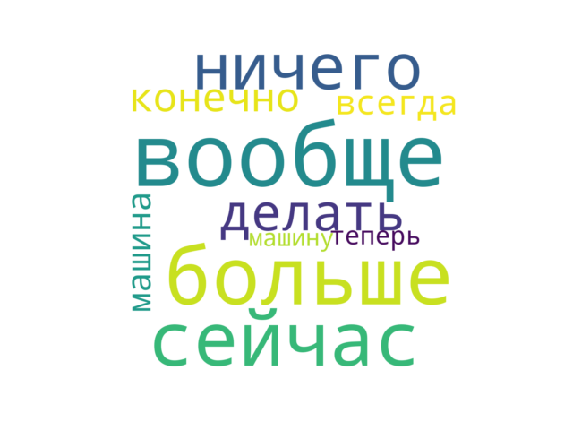

# Generate a word cloud from exported telegram chat

## How to use

Export chat history as JSON and run the script as pyhton ```tcloud.py --chat=[path_to_JSON] --max=100 --notshorter=4```<br>
This will create a cloud from words not shorter than 4 characters long.<br>
It skips function words by default but only for russian language at the moment, will add english ones later.<br>



## Requirements

    Python 3+

